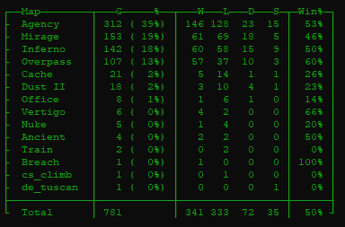
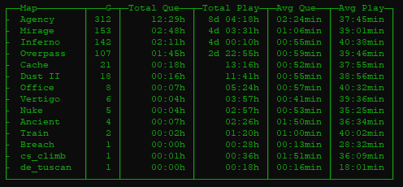
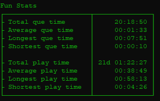
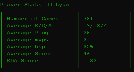

<div id="top">
<!-- src: https://github.com/othneildrew/Best-README-Template -->
<!-- see: https://www.markdownguide.org/basic-syntax/#reference-style-links -->
</div>

<div id="shields" align="center">

<!-- PROJECT SHIELDS -->
[![Contributors][contributors-shield]][contributors-url]
[![Forks][forks-shield]][forks-url]
[![Stargazers][stars-shield]][stars-url]
[![Issues][issues-shield]][issues-url]
[![MIT License][license-shield]][license-url]
[![Xing][xing-shield]][xing-url]
</div>

<!-- PROJECT LOGO -->
<div align="center">
  <a href="https://github.com/Helyux/csgo-match-history">
    
  </a>
  <br><br>
  <p align="center">
    Download your complete csgo matchhistory <br> Parse the gathered data to .json and <br> start a quick analysis on the data.
    <br><br>
    <a href="#demo-output">View Demo</a>
    ·
    <a href="https://github.com/Helyux/csgo-match-history/issues">Report Bug</a>
    ·
    <a href="https://github.com/Helyux/csgo-match-history/issues">Request Feature</a>
  </p>
</div>


<!-- TABLE OF CONTENTS -->
<details>
  <summary>Table of Contents</summary>
  <ol>
    <li>
      <a href="#about-the-project">About The Project</a>
    </li>
    <li>
      <a href="#getting-started">Getting Started</a>
      <ul>
        <li><a href="#prerequisites-airplane">Prerequisites :airplane:</a></li>
        <li><a href="#installation-zap">Installation :zap:</a></li>
        <li><a href="#configuration--clipboard">Configuration :clipboard:</a></li>
      </ul>
    </li>
    <!-- <li><a href="#usage">Usage</a></li> -->
    <li><a href="#demo-output">Demo Output</a></li>
    <li><a href="#roadmap">Roadmap</a></li>
    <li><a href="#contributing">Contributing</a></li>
    <li><a href="#license">License</a></li>
    <li><a href="#contact">Contact</a></li>
    <li><a href="#acknowledgments">Acknowledgments</a></li>
  </ol>
</details>


<!-- ABOUT THE PROJECT -->
## About The Project

<!-- [![Product Name Screen Shot][product-screenshot]](https://example.com) -->

As i'm someone who likes to analyze available data I thought, I have all this data on my competitive csgo matches.<br>
Why not start to analyze it? → So i did it :)<br>

Currently available data:
<ul>
  <li>Map info (times played, times played %, win, lose, draw, surrender and win%)</li>
  <li>Map misc (times played, map total que time, map total play time, map avg que time, map avg play time)</li>
  <li>Fun stats (total que time, total avg que time, absolute longest que time, absolute shortest que time)</li>
  <li>Fun stats (total play time, average play time, absolute longest play time, absolute shortest play time)</li>
  <li>Player stats (times played with, avg K/D/A, avg ping, avg mvps, avg hsp%, avg score, K/D/A Score)</li>
</ul>

<p align="right">(<a href="#top">back to top</a>)</p>


<!-- GETTING STARTED -->
## Getting Started

To get a local copy up and running follow these simple example steps.

### Prerequisites :airplane:
  
* Pipenv
```sh
pip install pipenv
```

### Installation :zap:

1. Clone the repository
  ```sh
   git clone https://github.com/Helyux/csgo-match-history
  ```
2. Install python packages from pipfile
  ```sh
   pipenv install
  ```
3. Run the entry script
  ```sh
   pipenv run python main.py
  ```

### Configuration  :clipboard:
1. Make a copy of template.toml named prod.toml in the base directory
2. Fill in the variables in prod.toml

<p align="right">(<a href="#top">back to top</a>)</p>


<!-- USAGE EXAMPLES 
## Usage

Blah Blah Blah, this is how you can use it, blah blah

_For more examples, please refer to the [Documentation](https://example.com)_

<p align="right">(<a href="#top">back to top</a>)</p>
-->


<!-- DEMO OUTPUT -->
## Demo Output

Here is some demo output, please excuse me being terrible at the game.

<div>




</div>


<p align="right">(<a href="#top">back to top</a>)</p>


<!-- ROADMAP -->
## Roadmap

- [ ] Add more available data
- [ ] Visualize already available data

See the [open issues](https://github.com/Helyux/csgo-match-history/issues) for a full list of proposed features (and known issues).

<p align="right">(<a href="#top">back to top</a>)</p>


<!-- CONTRIBUTING -->
## Contributing

Contributions are what make the open source community such an amazing place to learn, inspire, and create. Any contributions you make are **greatly appreciated**.

If you have a suggestion that would make this better, please fork the repo and create a pull request. You can also simply open an issue with the tag "enhancement".
Don't forget to give the project a star! Thanks again!

1. Fork the Project
2. Create your Feature Branch (`git checkout -b feature/AmazingFeature`)
3. Commit your Changes (`git commit -m 'Add some AmazingFeature'`)
4. Push to the Branch (`git push origin feature/AmazingFeature`)
5. Open a Pull Request

<p align="right">(<a href="#top">back to top</a>)</p>


<!-- LICENSE -->
## License

Distributed under the GPL-3.0 License. See `LICENSE` for more information.

<p align="right">(<a href="#top">back to top</a>)</p>


<!-- CONTACT -->
## Contact

Lukas Mahler - [@LyuxGG](https://twitter.com/LyuxGG) - [m@hler.eu](mailto:m@hler.eu)

Project Link: [https://github.com/Helyux/csgo-match-history](https://github.com/Helyux/csgo-match-history)

<p align="right">(<a href="#top">back to top</a>)</p>


<!-- ACKNOWLEDGMENTS -->
## Acknowledgments

Resources i used and found helpful while building this.

* [Choose an Open Source License](https://choosealicense.com)
* [Img Shields](https://shields.io)
* [Logo Generator](https://creecros.github.io/simple_logo_gen)

<p align="right">(<a href="#top">back to top</a>)</p>


<!-- MARKDOWN LINKS & IMAGES -->
<!-- https://www.markdownguide.org/basic-syntax/#reference-style-links -->
[contributors-shield]: https://img.shields.io/github/contributors/Helyux/csgo-match-history.svg?style=for-the-badge
[contributors-url]: https://github.com/Helyux/csgo-match-history/graphs/contributors
[forks-shield]: https://img.shields.io/github/forks/Helyux/csgo-match-history.svg?style=for-the-badge
[forks-url]: https://github.com/Helyux/csgo-match-history/network/members
[stars-shield]: https://img.shields.io/github/stars/Helyux/csgo-match-history.svg?style=for-the-badge
[stars-url]: https://github.com/Helyux/csgo-match-history/stargazers
[issues-shield]: https://img.shields.io/github/issues/Helyux/csgo-match-history.svg?style=for-the-badge
[issues-url]: https://github.com/Helyux/csgo-match-history/issues
[license-shield]: https://img.shields.io/github/license/Helyux/csgo-match-history.svg?style=for-the-badge
[license-url]: https://github.com/Helyux/csgo-match-history/blob/master/LICENSE
[xing-shield]: https://img.shields.io/static/v1?style=for-the-badge&message=Xing&color=006567&logo=Xing&logoColor=FFFFFF&label
[xing-url]: https://www.xing.com/profile/Lukas_Mahler10
